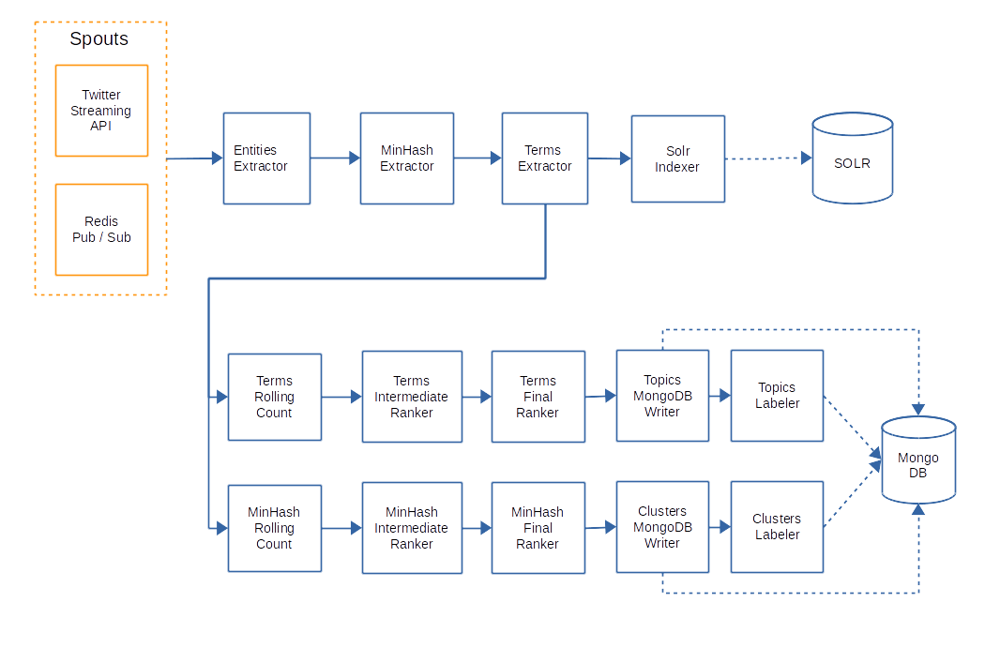

mklab-focused-crawler
=====================

The main purpose of topic-detector part of focused crawler is the extraction of trending topics contained in items shared through social networks. By trending topis we refer to frequent features (n-grams, named entities, hashtahs) that exhibit an abnormal increase on the current timeslot compared to the previous ones.

The main pipeline of topic-detector is implemented as a storm topology, where the sequential bolts perform a specific operation on the detection procedure. The overall topology is depiced in the following figure:


The input stream consists of items: these refer to tweets published in Twitter. There are two spouts that are possible to inject items in the topology: a) one that listens to a Redis message broker following the Publish/Subscribe pattern, and c) one waiting for incoming items from Twitter's Streaming API.
The items fed to the detector through Redis may be produced by any independent process. One possibility is to use the [Stream Manager project](https://github.com/MKLab-ITI/mklab-stream-manager).


The first bolt in the topology extracts named entities from the text of the messages injected in the topology by the spouts. For this procedure Stanford NER extractor is used. The next bolt extracts a signature from the text based on the MinHash algorithm. Intuitively, items with similar text will have identical signatures. The next bolt extracts terms from the items i.e. n-grams and hashtags. These three bolts add the extracted data in the corresponding fields of the Item class. Solr indexer bolt used to index the items in a runnign instance of Solr. This index can be used afterwards to get the items relevant to an extracted topic.

At that point the topology is splitted into two parallel pipelines: the first one is used to extract trending topics based on trending terms, while the second used to cluster items based on minhash signature. Both of these pipelines use the same sequence of bolts, operate on a different field of the items (terms and minhash signature respectively).

The first bolt in these pipelines is the TermsRollingCountBolt. This bolt performs rolling counts of incoming objects (terms or minhash).  Rolling means that by using a sliding window the bolt keeps track of statistics of an object to the current time window compared to the previous ones. At the end of each time window, the bolt emits a rolling count tuple per object, consisting of the object itself, its latest rolling count, a metric that indicates how trending is the object and the actual duration of the sliding window (just for testing as the length of the windows is constant).

As each object can emmited from multiple nodes in a distributed topology, the next two bolts used to aggregate and rank the objects, in a map-reduce fashion. The final ranking bolt emits a ranking of top objects (terms or minhash) for the current time window. Finally, each of the objects in the rank is stored in a mongodb instance. The time stamp of the current window is also store in order to keeop track of the evolution of these objects over time. Finally, for each of the emitted top objects a label is extracted by using the text of the indexed items. namely, using the terms or the minhash value a solr query is performed. From this query we get the most relevant and most popular item and we use its text as a label of the object.


### Building & Configuration  

To run the predefined topology (with Redis as a spout) a set of parameters has to be specified in the configuration [file](https://github.com/MKLab-ITI/mklab-focused-crawler/blob/dice/src/main/resources/dice.topic-detector.xml). The first parameters have to be specified are those concern the running instance of redis (if redis used as a spout):

```sh
    <redis>
        <hostname>xxx.xxx.xxx.xxx</hostname>
        <port>6379</port>
        <itemsChannel>DiceWebPages</itemsChannel>
    </redis>
```

If you want to use Twitter's Streaming API as a spout (recommented) the following part must be defined:

```sh
  <twitter>
        <consumerKey></consumerKey>
        <consumerSecret></consumerSecret>
        <accessToken></accessToken>
        <accessTokenSecret></accessTokenSecret>
    </twitter>
```

The next part is the section that specifies solr parametets:

```sh
    <textindex>
        <host>xxx.xxx.xxx.xxx</host>
        <port>8983</port>port>
        <collections>
        	 <items>MediaItems</items>
        </collections>
    </textindex>
```

The running instance of Solr has to contain to cores, corresponding to items. The configuration files and the schema of each of these cores can be found [here](https://github.com/MKLab-ITI/mmdemo-dockerized/tree/master/solr-cores).


To store detected topics and clusters in mongo db the following section must be defined:
```sh
  <mongodb>
      <hostname>xxx.xxx.xxx.xxx</hostname>
      <db>db name</db>
      <collection>topics</collection>
      <clusters>topics</clusters>
  </mongodb>
```

Finally, to specify whether storm topology will run in a storm cluster or in local mode the following section has to be set:
```sh
<topology>
    <focusedCrawlerName>DiceTopicDetector</focusedCrawlerName>
    <local>true</local>
</topology>
```
If *local* parameter is true then the topology will run in a simulated local cluster:
```sh
      LocalCluster cluster = new LocalCluster();
      cluster.submitTopology(name, conf, topology);
```

In other case the topology will be submitted in a running storm cluster:
```sh
      StormSubmitter.submitTopology(name, conf, topology);
```

Note that setting of parameters in the configuration file, must be performed before jar building, as that jar has to contain all the necessary files for execution.
To build the executable jar use the following mvn command:

```sh
  $mvn clean assembly:assembly
```

The generated jar, named *focused-crawler-jar-with-dependencies.jar*, contains all the dependencies and the configuration file described above and can be used for submission in a running storm cluster. The main class of the topology is *gr.iti.mklab.focused.crawler.TrendingTopicsDetector*. This entry point is specified in the pom.xml file in the maven-assembly-plugin.

To submit on storm:
```sh
  storm jar focused-crawler-jar-with-dependencies.jar
                        gr.iti.mklab.focused.crawler.TrendingTopicsDetector
```


## For more details about the project contact

Manos Schinas (manosetro@iti.gr), Symeon Papadopoulos (papadop@iti.gr)
